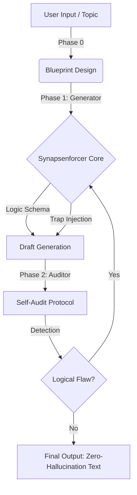

# Synapsenforcer 🧠
> **A Logical Constraint Enforcement Framework for LLMs**
> LLM의 논리적 환각(Hallucination)을 제어하고 고밀도 추론 텍스트를 생성/검증하는 프롬프트 아키텍처

[](https://opensource.org/licenses/MIT)
[]()
[]()

## 📌 Overview
**Synapsenforcer** is a systematic prompting framework designed to produce **high-density, logically rigorous texts** comparable to high-stakes reasoning exams (e.g., LSAT, LEET).

Unlike standard prompts that rely on the LLM's probability distribution, this framework enforces strict **"Logic Schemas"** and **"Proprietary Trap Protocols"** to prevent hallucinations in causal reasoning, mathematical modeling, and data interpretation. Currently, this script achieved near-zero hallucination rates in internal benchmarks.

이 프로젝트는 LLM이 생성하는 텍스트의 논리적 밀도를 극한으로 높이고, 인과관계 오류를 방지하기 위해 설계된 **'논리 제약 강제 프레임워크'**입니다. 동아시아 최고 난이도 적성시험인 **LEET(법학적성시험)** 수준의 지문을 생성하며, 생성된 문제를 스스로 검증하는 **Self-Auditing Pipeline**을 갖추고 있습니다. 현재 스크립트의 환각률은 거의 0에 이르고 있습니다.

## Lite version Sample: https://gemini.google.com/gem/19F49JK2XZQ9pd0jrrg5d6xTOn3wAcOKB?usp=sharing (For analyzing article)



## 🚀 Key Features

### 1. Dual-Core Architecture (생성-검증 이원화)
* **Generator (Synapsenforcer):** Forces the model to follow specific argumentative structures (e.g., Dialectical Deepening) and embed sophisticated logical traps.
* **Auditor (Logic Debugger):** A specialized persona that dissects the generated text into atomic units to detect logical flaws, ensuring **Zero-Hallucination**.

### 2. The 11 Trap Protocols (Black-box Logic)
**Synapsenforcer** utilizes 11 proprietary logic gates to simulate high-level cognitive distortions and verify internal consistency. These protocols are categorized into three dimensions:

* **⚡ Structural & Causal Traps:**
    * Detects and generates sophisticated logical fallacies such as **Causal Reversal** (reversing cause and effect) and **Partial Truths** (breaking logical chains).
* **⚖️ Semantic & Modal Traps:**
    * Strictly controls the **Modality Shift**
* **📊 Data & Symbolic Traps:**
    * **Visual Integrity:** Ensures logical isomorphism between textual arguments and JSON-based charts/graphs.
    * **Symbolic Algebra:** Treats abstract symbols (e.g., ㉠, $R=f(x)$) as immutable variables to prevent contextual drifting.

* As a result, **By strictly defining logic schemas and trap taxonomies,** this prompt creates a controlled generation environment that significantly reduces model hallucinations.


> *Note: The specific prompt instructions for these protocols are redacted in this public repository to protect intellectual property.*

## 📂 Project Structure

```bash
Synapsenforcer/
├── core_logic/
│   ├── making LEET question rule.py    # Phase 1: Passage & Problem Construction
├── examples/                           # Case Studies (High-Quality Benchmarks)
│   ├── Case_01_Legal_Tech.md           # The Paradox of Automated Enforcement
│   ├── Case_02_Phenomenology.md        # Body Schema vs Body Image
│   └── Case_03_Quantum_Ontology.md     # EPR Paradox & Bell's Inequality
│   └── Case_04_Procrustean Bed of Social Science.md  # Social Science
└── assets/
    └── logic_diagram.png
```


## 🛠️ Usage Scenario

This framework can be applied to:
1.  **Synthetic Data Generation:** Creating high-quality, hallucination-free training data for logical reasoning models (CoT).
2.  **EdTech & Evaluation:** Automating the creation of high-stakes exam materials (PSAT, NCS, LEET, SAT).
3.  **Document Auditing:** Detecting toxic clauses, logical fallacies, or internal contradictions in legal/financial documents.

## 🧬 Generated Sample: "From Text to Audit"
This demonstrates the framework's capability to generate high-density text and immediately self-audit for logical consistency.

1. Generated Passage (Snippet)
Topic: Philosophy of Social Science (Methodology)

...사회과학자들은 종종 치명적인 유혹에 빠진다. 모델이 현실을 설명하지 못할 때, 모델을 수정하는 것이 아니라 현실을 왜곡하여 모델에 끼워 맞추는 것이다. 이는 마치 그리스 신화에 등장하는 **ⓐ'프로크루스테스의 침대(Procrustean Bed)'**와 같다.

사회과학에서 '침대'는 연구자가 설정한 우아한 수학적 모델이며, '나그네'는 복잡다단한 현실이다. 연구자들은 모델의 정합성(Coherence)을 유지하기 위해, 설명되지 않는 변수들—문화, 심리, 우연, 역사적 맥락—을 '통제 불가능한 노이즈'로 치부하며 가차 없이 잘라낸다. 이러한 **'임의적 제거(Arbitrary Elimination)'**는 단순한 생략이 아니다... (후략)

2. AI Generated Audit Report (Self-Correction Log)
```json
{
  "review_meta": {
    "difficulty_level": "상 (High)",
    "difficulty_rationale": "사회과학 방법론의 맹점인 '임의적 변수 제거'를 신화적 비유(프로크루스테스의 침대)를 통해 비판함. 단순한 독해가 아니라 비유의 구조적 대응과 타 학문(생태학)으로의 전이 능력을 요구함.",
    "core_architectonics": "폐쇄 체계(침대/모델) vs 개방 체계(나그네/현실)의 충돌 및 그로 인한 파국(피드백)"
  },
  "cognitive_reconstruction": {
    "flow_log": [
      "1문단: 실증주의 사회과학의 통념(세테리스 파리부스)과 이를 통한 단순화 전략 확인.",
      "2문단: 비판적 실재론의 관점에서 '폐쇄 체계(실험실)'와 '개방 체계(현실)'의 존재론적 차이 포착.",
      "3문단: '프로크루스테스의 침대' 비유를 통해 모델이 현실을 재단하는 폭력성을 구조화.",
      "4문단: 제거된 변수들의 역습(피드백 루프)과 2008년 금융위기 사례를 통한 논지 강화.",
      "5문단: '법칙'이 아닌 '경향성'을 탐구해야 한다는 결론 도출."
    ]
  },
  "item_dissection": [
    {
      "question_index": 1,
      "applied_trap_code": "TRAP_06 (Modality Shift)",
      "option_analysis": [
        {
          "option_num": 5,
          "status": "Correct (Selection of Incorrect)",
          "audit_result": "Critical Eye",
          "commentary": "[REDACTED - Proprietary Logic Model v2.0]"
        }
      ]
    },
    {
      "question_index": 2,
      "applied_trap_code": "Type_A_Concrete_Application (Metaphor Mapping)",
      "option_analysis": [
        {
          "option_num": 1,
          "status": "Correct",
          "audit_result": "Structural Isomorphism",
          "commentary": "비유의 3요소(형식, 대상, 제거된 것)를 보기의 사례(모델, 범죄 현실, 빈곤/유대감)에 1:1로 정확하게 대응시킴."
        }
      ]
    },
    {
      "question_index": 3,
      "applied_trap_code": "Type_B_Domain_Transfer",
      "option_analysis": [
        {
          "option_num": 1,
          "status": "Correct",
          "audit_result": "Analogical Reasoning",
          "commentary": "사회과학의 논리(폐쇄 체계 실험 ≠ 개방 체계 현실)를 생태학 실험에 적용함. '격리된 숲'은 실험실(폐쇄 체계)이고 '자연계'는 현실(개방 체계)이므로, 연구 결과를 그대로 확장할 수 없다는 비판적 실재론의 입장을 대변함."
        }
      ]
    }
  ]
}
```


## 👨‍💻 Author
**Glocke von Pavlov (파블로프의자명종)**
* Logic Architect & Prompt Engineer
* Specialization: Designing constraint-based reasoning engines for LLMs.


* "This repository contains the Lite Version of the Trap Protocols. The full implementation of advanced logic gates (TRAP_06, 07, 09), which are critical for preventing high-level hallucinations in legal/mathematical contexts, is available upon request for technical due diligence or partnership inquiries."

