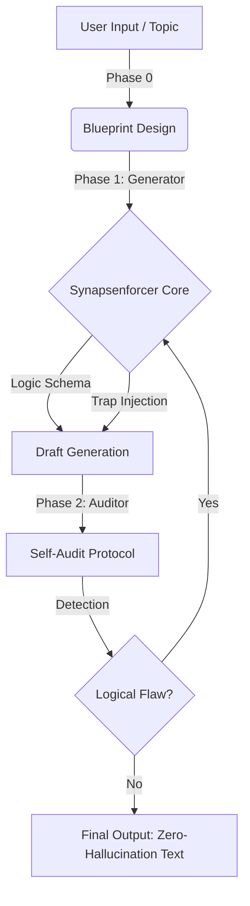

# Synapsenforcer 🧠
> **A Logical Constraint Enforcement Framework for LLMs**
> LLM의 논리적 환각(Hallucination)을 제어하고 고밀도 추론 텍스트를 생성/검증하는 프롬프트 아키텍처

[](https://opensource.org/licenses/MIT)
[]()
[]()

## 📌 Overview
**Synapsenforcer** is a systematic prompting framework designed to produce **high-density, logically rigorous texts** comparable to high-stakes reasoning exams (e.g., LSAT, LEET).

Unlike standard prompts that rely on the LLM's probability distribution, this framework enforces strict **"Logic Schemas"** and **"Proprietary Trap Protocols"** to prevent hallucinations in causal reasoning, mathematical modeling, and data interpretation. Currently, this script achieved near-zero hallucination rates in internal benchmarks.

이 프로젝트는 LLM이 생성하는 텍스트의 논리적 밀도를 극한으로 높이고, 인과관계 오류를 방지하기 위해 설계된 **'논리 제약 강제 프레임워크'**입니다. 동아시아 최고 난이도 적성시험인 **LEET(법학적성시험)** 수준의 지문을 생성하며, 생성된 문제를 스스로 검증하는 **Self-Auditing Pipeline**을 갖추고 있습니다. 현재 스크립트의 환각률은 거의 0에 이르고 있습니다.



## 🚀 Key Features

### 1. Dual-Core Architecture (생성-검증 이원화)
* **Generator (Synapsenforcer):** Forces the model to follow specific argumentative structures (e.g., Dialectical Deepening) and embed sophisticated logical traps.
* **Auditor (Logic Debugger):** A specialized persona that dissects the generated text into atomic units to detect logical flaws, ensuring **Zero-Hallucination**.

### 2. The 12 Trap Protocols (Black-box Logic)
**Synapsenforcer** utilizes 11 proprietary logic gates to simulate high-level cognitive distortions and verify internal consistency. These protocols are categorized into three dimensions:

* **⚡ Structural & Causal Traps:**
    * Detects and generates sophisticated logical fallacies such as **Causal Reversal** (reversing cause and effect) and **Partial Truths** (breaking logical chains).
* **⚖️ Semantic & Modal Traps:**
    * Strictly controls the **Modality Shift** (e.g., distinguishing between 'possibility' and 'necessity', 'is' and 'ought') to prevent subtle semantic hallucinations.
* **📊 Data & Symbolic Traps:**
    * **Visual Integrity:** Ensures logical isomorphism between textual arguments and JSON-based charts/graphs.
    * **Symbolic Algebra:** Treats abstract symbols (e.g., ㉠, $R=f(x)$) as immutable variables to prevent contextual drifting.

* As a result, **By strictly defining logic schemas and trap taxonomies,** this prompt creates a controlled generation environment that significantly reduces model hallucinations.


> *Note: The specific prompt instructions for these protocols are redacted in this public repository to protect intellectual property.*

## 📂 Project Structure

```bash
Synapsenforcer/
├── core_logic/
│   ├── generator_rules.py    # Phase 1: Passage & Problem Construction
│   └── solver_rules_v2.py    # Phase 2: Audit & Debugging Protocol (Updated)
├── examples/                 # Case Studies (High-Quality Benchmarks)
│   ├── Case_01_Legal_Tech.md       # The Paradox of Automated Enforcement
│   ├── Case_02_Phenomenology.md    # Body Schema vs Body Image
│   └── Case_03_Quantum_Ontology.md # EPR Paradox & Bell's Inequality
│   └── Case_04_Procrustean Bed of Social Science.md  # Social Science
└── assets/
    └── logic_diagram.png
```


## 🛠️ Usage Scenario

This framework can be applied to:
1.  **Synthetic Data Generation:** Creating high-quality, hallucination-free training data for logical reasoning models (CoT).
2.  **EdTech & Evaluation:** Automating the creation of high-stakes exam materials (PSAT, NCS, LEET, SAT).
3.  **Document Auditing:** Detecting toxic clauses, logical fallacies, or internal contradictions in legal/financial documents.


## 👨‍💻 Author
**Glocke von Pavlov (파블로프의자명종)**
* Logic Architect & Prompt Engineer
* Specialization: Designing constraint-based reasoning engines for LLMs.


* "This repository contains the Lite Version of the Trap Protocols. The full implementation of advanced logic gates (TRAP_06, 07, 09), which are critical for preventing high-level hallucinations in legal/mathematical contexts, is available upon request for technical interviews or partnership inquiries."

